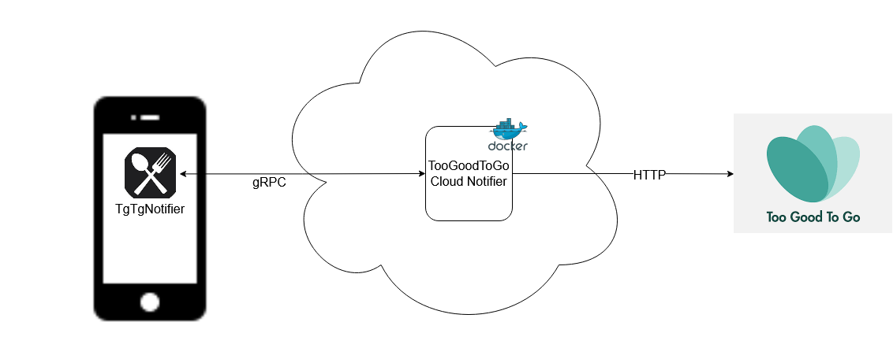
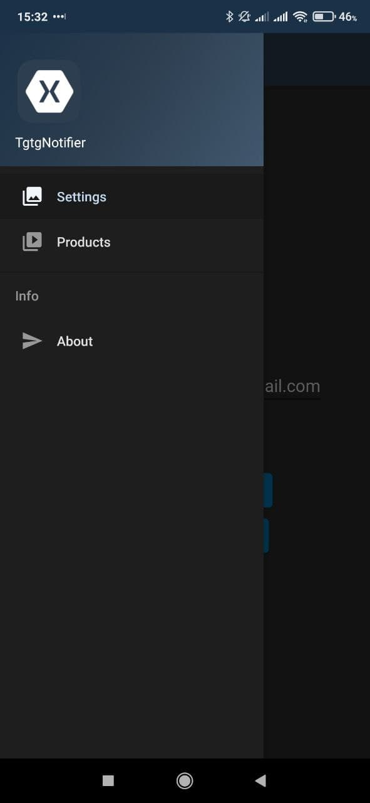
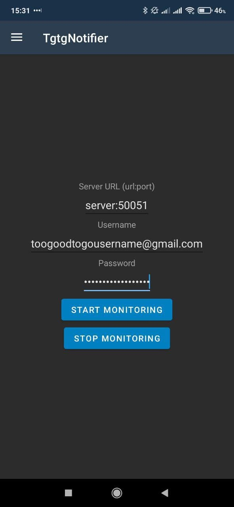
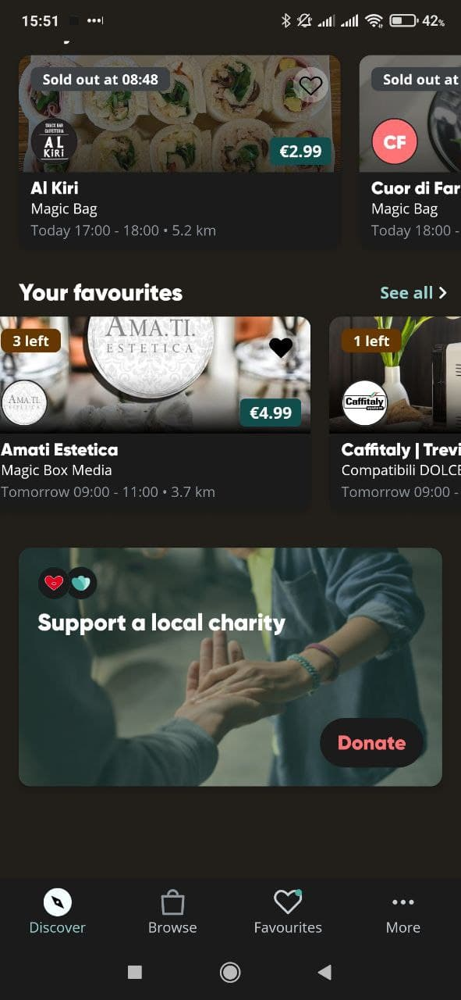
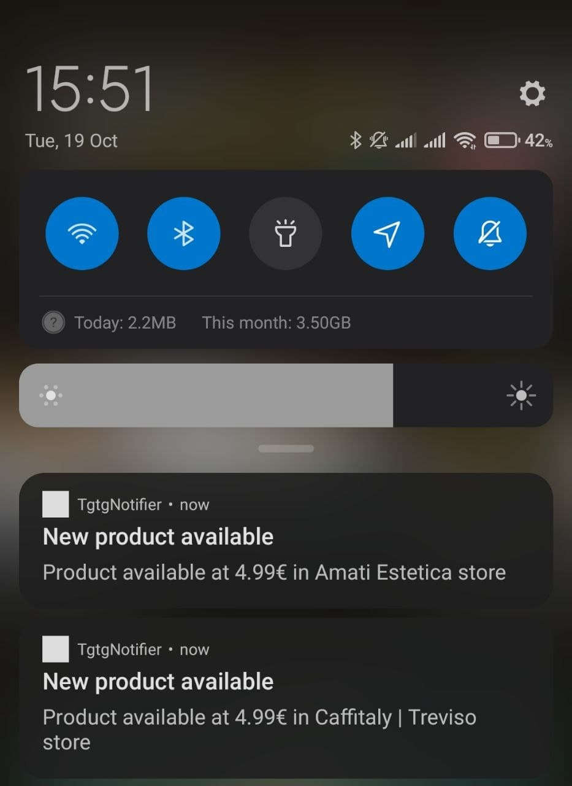

**TgTgNotifier** is a mobile Android application which sends a notification when your favourite products are available on [TooGoodToGo](https://toogoodtogo.com/en-us). This app has been developed using [Xamarin.Android](https://docs.microsoft.com/en-us/xamarin/android/).

## Architecture

This application is client of [**TooGoodToGo Cloud Notifier**](https://github.com/JordanGottardo/too-good-to-go-cloud-notifier) server component and requires it in order to function correctly.
Below you can see an high level system architecture.

# Installation
You can install [TgTgNotifier directly from the Google Play Store](https://play.google.com/store/apps/details?id=com.jordangottardo.tgtgnotifier) (available in Italian and English).

# Configuration
## Notification and battery savings options
Before proceeding with configuration, it is important to notice that this app uses a periodic background worker in order to retrieve products availability information and show notifications when those products are available.

Many Android vendors employ battery savings and optimizations on their devices in order to prolong battery life. Those optimizations could break this application. Hence, if you don't receive any notification from TgTgNotifier, please disable battery savings options for this app on your device. More info on how to do this on [dontkillmyapp.com](https://dontkillmyapp.com/).

## Product monitoring setup
In order to receive products notifications, you need to set up the application via the settings tab.

Once you have accessed the settings tab, you need to fill the required three fields with:
1. Server URL and port where [TooGoodToGo Cloud Notifier](https://github.com/JordanGottardo/too-good-to-go-cloud-notifier) can be reached via gRPC (example: tgtgcloudnotifier.mydomain.com:50051)
2. TooGoodToGo email (the one you use to log into TooGoodTooGo)
3. TooGoodToGo password  (the one you use to log into TooGoodToGo)

After you have filled the required inputs, you need to press on the "Start Monitoring" button.

Every 15 minutes you will be notified if one of your favourite products is available (notifications with a delay smaller than 15 minutes are not available right now due to Android policy on background workers).

## Product notifications
After the setup is complete, suppose you have added some products to your favourites on TooGoodToGo:

TgTgNotifier will send a notification every time one of your favourite products become available, as you can see in the example below.

